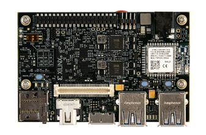
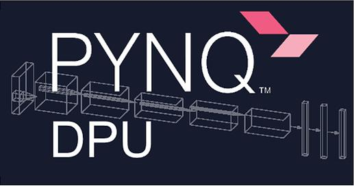

\



## Grab the pre-built SD images

Click the releases tab above or [click here to obtain SD card images and instructions for Ultra96 v1 or v2](https://github.com/Avnet/Ultra96-PYNQ/releases)

## Xilinx Vitis AI hardware accelerated inference for PYNQ >= v2.5

Supports Ultra96 v1 and v2, ZCU104 and ZCU111, [click here for how to get started!](https://www.hackster.io/wadulisi/easy-ai-with-python-and-pynq-dd4822)



## Build your own PYNQ SD image for Ultra96 v1/v2

This is optional for advanced users if they want to rebuild a PYNQ image.

This repository contains source files and instructions for building PYNQ to run on the [Ultra96 board](http://zedboard.org/product/ultra96).
Users can leverage the included Petalinux BSPs to build the images on their own.

Building PYNQ for Ultra96 can take many hours to complete.  Plan accordingly!

**Required tools:**

* Ubuntu 16.04 LTS 64-bit host PC
* Passwordless SUDO privilege for the building user
* At least 160GB of free hard disk space if you do not have the Xilinx tools installed yet
* Roughly 80GB of free hard drive space if you have the Xilinx tools installed
* You may be able to work with less free hard drive space, YMMV
* At least 8GB of RAM (more is better)
* Xilinx Petalinux and Vivado or SDx (find the version compatible with a specific PYNQ release at
[Xilinx Tool Version](https://pynq.readthedocs.io/en/latest/pynq_sd_card.html))
* Read Xilinx UG1144 for Petalinux host PC setup requirements
* [Create a Xilinx account](https://www.xilinx.com/registration/create-account.html) to obtain and license the tools

### Step 1: Clone and configure the Ultra96 repository

Retrieve the Ultra96 PYNQ board git into a new directory somewhere outside the PYNQ git directory.
You can define the path to this new directoy (adjust this path if you want).

```shell
export LOCAL_ULTRA96=$(pwd)/ultra96-pynq-git
```

Then we can clone the repository, and setup Ultra96-PYNQ git to work on 
a branch (for example,`image_v2.6.0`).

```shell
git clone https://github.com/Avnet/Ultra96-PYNQ.git $LOCAL_ULTRA96
cd $LOCAL_ULTRA96
git checkout -b image_v2.6.0 origin/image_v2.6.0
```

BSPs for Ultra96 v1 and v2 are already included in this repo. 
Users can use these BSPs to build PYNQ images by themselves.
If you would like to build your own BSPs, [see notes at bottom](#build-pynq-compatible-bsps-from-scratch).

Now you must create and setup appropriate files for Ultra96 v1 or v2.
Change the softlinks to point to the desired board version spec file.

For Ultra96 v1:

```shell
cd $LOCAL_ULTRA96/Ultra96
ln -s specs/Ultra96_v1.spec Ultra96.spec
ln -s petalinux_bsp_v1 petalinux_bsp
cp -f sensors96b/sensors96b.bit.v1 sensors96b/sensors96b.bit
cp -f sensors96b/sensors96b.tcl.v1 sensors96b/sensors96b.tcl
cp -f sensors96b/sensors96b.hwh.v1 sensors96b/sensors96b.hwh
```

For Ultra96 v2:

```shell
cd $LOCAL_ULTRA96/Ultra96
ln -s specs/Ultra96_v2.spec Ultra96.spec
ln -s petalinux_bsp_v2 petalinux_bsp
cp -f sensors96b/sensors96b.bit.v2 sensors96b/sensors96b.bit
cp -f sensors96b/sensors96b.tcl.v2 sensors96b/sensors96b.tcl
cp -f sensors96b/sensors96b.hwh.v2 sensors96b/sensors96b.hwh
```

### Step 2: Setup PYNQ repository and building environment

Retrieve the main PYNQ repo into a new directory somewhere outside the Ultra96-PYNQ directory.
You can define the path to this new directoy (adjust this path if you want).

```shell
export LOCAL_PYNQ=$(pwd)/pynq-git
```

Clone and setup PYNQ git to work on a branch (for example, `image_v2.6.0`).

```shell
git clone https://github.com/Xilinx/PYNQ.git $LOCAL_PYNQ
cd $LOCAL_PYNQ
git checkout origin/image_v2.6.0
```

Configure and install build tools, this will take some effort and will be an iterative process. Run `setup_host.sh` to install missing tools, `make checkenv` to check if all tools are installed.

```shell
cd sdbuild
./scripts/setup_host.sh
make checkenv
```

### Step 3: Build PYNQ image

In your PYNQ repository go to the directory `sdbuild` and run make.

**IMPORTANT: For the BOARDDIR path setting it should be absolute not relative, you have been warned!**

```shell
make clean
make BOARDDIR=$LOCAL_ULTRA96
```

Once the build has completed (it will take a long long time), if successful an SD card image will be available under the PYNQ git directory `sdbuild/output`. Depending on the PYNQ release, the image may have different names. As an example, for PYNQ v2.5, the image is `Ultra96-2.5.img`.

Use Etcher or Win32DiskImager to write this image to an SD card.

Insert card, PYNQ should boot up on the Ultra96!

For more information about how to setup and use PYNQ for Ultra96, please refer to the [online documentation](https://ultra96-pynq.readthedocs.io/en/latest/).

## Build PYNQ-compatible BSPs from scratch

**IMPORTANT: for Ultra96 v1 and v2, u-boot source may not compile without Petalinux patches.**

If making your own bsp and building it outside of Ultra96 PYNQ, you must include the [u-boot fixes](https://github.com/Avnet/Ultra96-PYNQ/tree/master/Ultra96/petalinux_bsp_v1/meta-user/recipes-bsp/u-boot).
If building your bsp within the Ultra96 PYNQ build system, the u-boot fixes will be automatically applied.

Building your own bsp is optional. It is only needed if you have a good reason not to use the included BSP.

Obtain and install Xilinx Vivado or SDx and Petalinux on Ubuntu 16.04 LTS. For Xilinx tools, you will need a version compatible with the PYNQ release (for Xilinx tool compatibility, see [Xilinx Tool Version](https://pynq.readthedocs.io/en/latest/pynq_sd_card.html)). If you are installing the Xilinx tools for the first time on your existing setup you must read Xilinx UG1144 for Petalinux setup requirements.

If you prefer, you can also setup all the tools on a VirtualBox VM (e.g. using [Vagrant software](https://pynq.readthedocs.io/en/latest/pynq_sd_card.html#prepare-the-building-environment)).  
If you purchased an Ultra96 board, a free voucher for the full-version Xilinx SDX tool suite and Petalinux is included.

### Step 1: Hardware design

Use the Xilinx SDx or Vivado tools to generate the hardware design. The hardware design source files contain a PL (Xilinx Programmable Logic) design that will enable PYNQ to interact with a Grove mezzanine board. The hardware design also contains Ultra96 board specific settings. After building the hardware design, it will need to be manually imported into the Petalinux BSP.

To build the hardware design for Ultra96 v1:

```shell
cd $LOCAL_ULTRA96/Ultra96/sensors96b
cp -f sensors96b.tcl.v1 sensors96b.tcl
make
```

To build the hardware design for Ultra96 v2:

```shell
cd $LOCAL_ULTRA96/Ultra96/sensors96b
cp -f sensors96b.tcl.v2 sensors96b.tcl
make
```

### Step 2: Create and configure BSP

After the hardware design has finished building and you have installed Petalinux,
create the Ultra96 BSP by executing Petalinux commands:

```shell
cd $LOCAL_ULTRA96
mkdir bsp
cd bsp
petalinux-create -t project -n sensors96b --template zynqMP
cd sensors96b
petalinux-config --get-hw-description=../../Ultra96/sensors96b
```

After the system config menus appear you need to set the following case-sensitive values, after completion exit and save:

* Subsystem AUTO Hardware Settings → Serial Settings → PMUFW serial stdin/stdout → (psu_uart_1)
* Subsystem AUTO Hardware Settings → Serial Settings → FSBL serial stdin/stdout → (psu_uart_1)
* Subsystem AUTO Hardware Settings → Serial Settings → ATF serial stdin/stdout → (psu_uart_1)
* Subsystem AUTO Hardware Settings → Serial Settings → DTG serial stdin/stdout → (psu_uart_1)
* DTG Settings → MACHINE_NAME → (avnet-ultra96-rev1)
* u-boot Configuration → u-boot config → (other)
* u-boot Configuration → u-boot config target → keep this empty.
* Image Packaging Configuration → Root filesystem type → (EXT4 (SD/eMMC/SATA/USB))
* Yocto Settings → YOCTO_MACHINE_NAME → (ultra96-zynqmp)

To work around a potential bug for Ultra96 that prevents including your own hardware design you must edit:  
`$LOCAL_ULTRA96/bsp/sensors96b/project-spec/meta-user/conf/petalinuxbsp.conf`.  

Add the following line at the bottom of the file:

```shell
MACHINE_FEATURES_remove_ultra96-zynqmp = "mipi"
```

For Ultra96 v2 you may want to remove the TI WiFi driver module. To do this:

```shell
petalinux-config -c kernel
```

Locate the following configuration:

* Device Drivers → Network device support → Wireless LAN → Texas Instrument devices

Type 'n' to deselect it. Save the configuration using the default name and exit.

### Step 3: Package BSP

Finish creating the BSP by packaging it up into a single BSP file and placing it for PYNQ to find.

For Ultra96 v1:

```shell
cd $LOCAL_ULTRA96/bsp
petalinux-package --bsp --force -p sensors96b --hwsource ../Ultra96/sensors96b/sensors96b --output ../Ultra96/sensors96b_v1.bsp
```

For Ultra96 v2:

```shell
cd $LOCAL_ULTRA96/bsp
petalinux-package --bsp --force -p sensors96b --hwsource ../Ultra96/sensors96b/sensors96b --output ../Ultra96/sensors96b_v2.bsp
```

Note: The PYNQ packages scripts and extra files will pull in v2 critical changes automatically such as the wifi driver.
